= Homework 1 Group 14

*Team members:*

* Varuni Rao
* Ummul Mukta
* Nishanth Holla Raghavendra
* Aravind Sarma Yeluripati

== IMPORT DATA

1 - Start R Studio and import the data set into your environment
[source,R]
----
# load data
housing <- read.csv("C:/…//housing.csv", header = TRUE)
----

output:

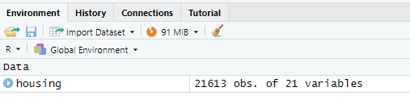

[source,R]
----
# find the dimension of data frame
dim(housing)
----

output:

 [1] 21613    21

== EXPLORE THE DATA

2 - Start exploring the data by looking at the first few observations.

[source,R]
----
# show the first six rows
head(housing)
----

output:

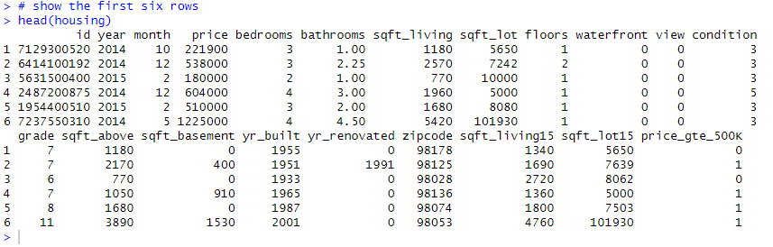

[source,R]
----
# show all the data in a new tab
View(housing)
----
output

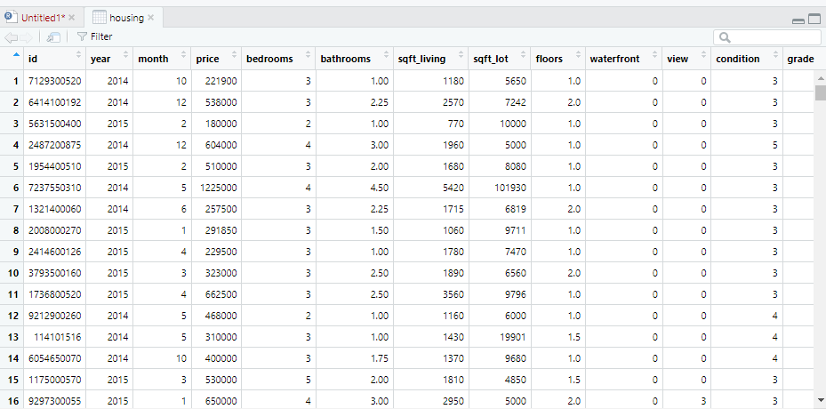

3 - see summary statistics for each variable

[source,R]
----
# find summary statistics for each column
summary(housing)
----
output

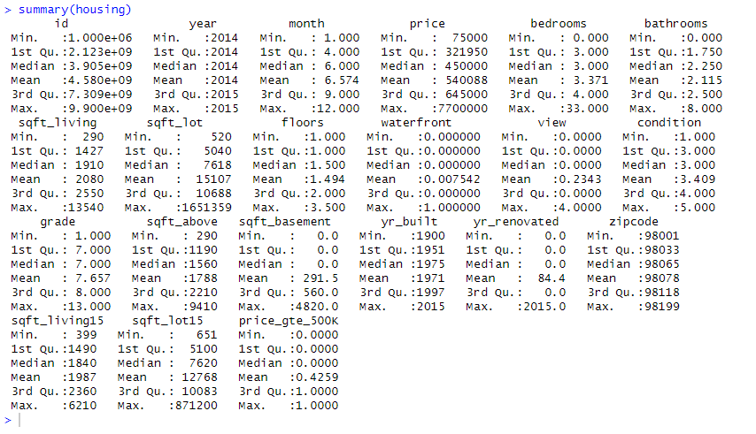

Question: Do any of these measures seem unreasonable?

Answers:

* 0 bathrooms is questionable, maybe there’s missing data.
* The summary data for year of innovation seems useless
* The summary data for zip codes is off too as the data is interpreted as numbers when it's supposed to be enum
* The mean of waterfront doesn't make sense either since a property is either a waterfront or it is not

== DATA VISUALIZATIONS IN  R

*ggplot2* is a key part of the tidyverse collection of R packages, which also includes the packages like
dplyr and tidyr. These are the most used packages in the initial steps of data analysis. “Gee-gee plot 2” is
the preeminent package used to create visualizations (graphical representations) of data is a key step in
being able to communicate information and findings to others.

Although R does provide built-in plotting functions, the ggplot2 package is built on the premise of the
Grammar of Graphics. Like all other packages, ggplot2 needs to be installed and activated

[source,R]
----
# install ggplot2 once
install.packages("ggplot2")
#the following wouldn't work since the quotes are missing
install.packages(ggplot2)
----

== HISTOGRAM

4 - Creating a histogram for the bedroom variable as follows

[source,R]
----
# Create a histogram
ggplot(housing) + geom_histogram(aes(x=bedrooms), bins=6)
----
output

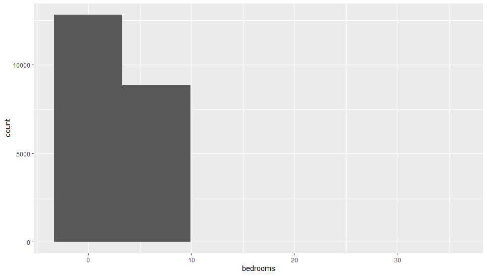

Questions:

* Which bedroom range has the greatest number of observations (i.e., tallest bar)?
** From the summary statistics, the mean number of bedrooms is *3.37*, and the 25th-75th percentile range is *3-4*. The most frequent range will likely be *3 to 4 bedrooms*, as this is common in standard housing data
* How many observations are there in this range?
** most houses have *3 or 4 bedrooms*, so this range will have the highest count
* What type of skew is this?
** Given the presence of extreme values like *33 bedrooms*, the distribution is right-skewed. This means most observations are concentrated in the lower range, with a tail extending to the right.
* What type of transformation would correct this skew?
** *Log transformation (log(bedrooms))* can help normalize the data. *Square root transformation (sqrt(bedrooms))* is another option to reduce skewness.

5 - Changing the properties the bedrooms histogram by changing the number of bins to 30

[source,R]
----
# Create a histogram with more detail
ggplot(housing) + geom_histogram(aes(x=bedrooms), bins=30)
----
output

image::../images/lineItem5.png[]

Questions:

* Having more bins provides a more detailed view
** YES
* Which range has the highest frequency in the plot?
** The range with 3 bedrooms is expected to have the highest frequency.
* How many observations are there for this range?

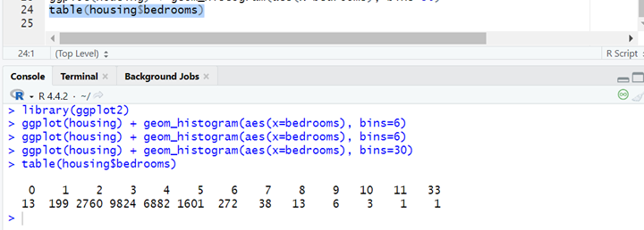

* what else can you infer from this histogram (about normally, outliers, and transformations?)
** Data is not normally distributed. Houses with 0 bedrooms and 33 bedrooms stand out as potential outliers

== BOXPLOT

8 -

[source,R]
----
# Create a boxplot for bathrooms
ggplot(housing) + geom_boxplot(aes(x=bathrooms))
----
output

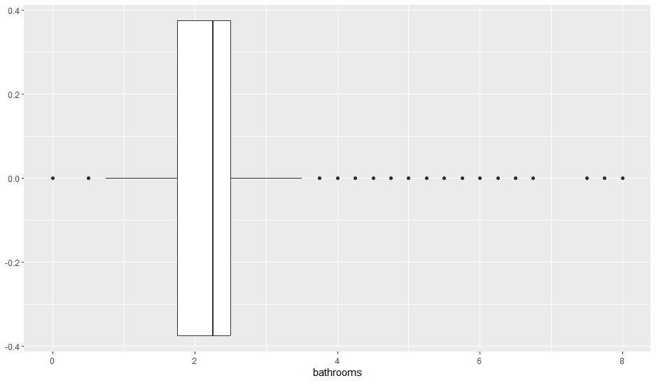

9 - Questions: Find the answers of the following:

* Minimum Whisker = 0
* Maximum Whisker = 8
* Median = 2
* First (25th) quartile = 1
* Third (75th) quartile = 3

== BOXPLOT and CATEGORICAL VARIABLES

10 - Creating box plots using a categorical breakdown will not only reveal data quality, but also show the
relationship between two variables.

[source,R]
----
# Create a boxplot for bathrooms by floors
ggplot(housing, aes(x=as.factor(floors), y=bathrooms)) +
  geom_boxplot() +
  xlab("Floors") +
  stat_summary(fun = mean,color="red", shape=12)
----
output

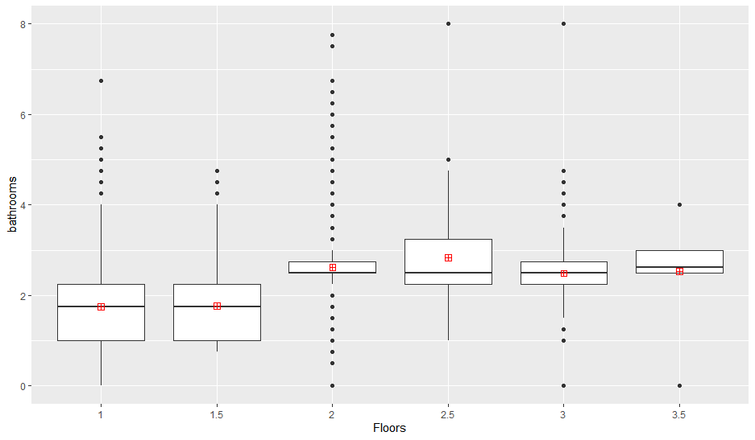

Questions:

a) Based on the box plots, which floors have the highest mean for bathrooms? (means are shapes on box plots)

* The floor with the highest mean for bathrooms is floor 2.5. The mean is represented by the red square within the box plot, and the mean for floor 2.5 is higher than the means for the other floors.

b) Identify the farthest outlier(s) for "bathrooms". Which floors have this outlier?

* The farthest outlier for "bathrooms" is at 8 bathrooms. This outlier is on floors 2.5 and 3.

== LINE GRAPH

11 - Line graphs are usually for time-series data. In this case, let's use it between two interval variables:
sqft_living and price. This chart will help see if there is a relationship between the two variables.

[source,R]
----
# Create a line graph for sqft_living and price
ggplot(data = housing) +
  geom_line(mapping = aes(x = sqft_living, y = price))
----
output

.Price Vs Sqft_living
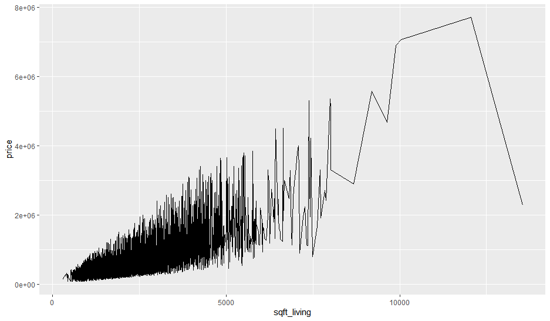

Questions:

* Which of the following best describes the relationship in the chart?
** Price increases as sqft living increases - TRUE
** Price decreases as sqft living increases - FALSE
* Does this relationship make sense in real world? Why/Why not?
** Larger homes generally cost more, as more square footage typically means higher home values due to increased construction costs and desirability. The prices of luxury homes display variability because price fluctuations emerge at extremely high square footage levels because of location factors, along with amenities, market demand, and custom-built luxury homes. The price drop in the rightmost section suggests that outliers, data errors, or large expansive homes with reduced per-square-foot prices because of decreasing marginal returns.

== LINE GRAPH MULTIPLE LINES

12 - Breaking down the previous chart (11) using a categorical variable, "waterfront". This will help validate/test the relationship we observed earlier for two conditions: waterfront or not.

[source,R]
----
# If the waterfront variable isn’t a factor (categorical) then it needs to be transformed:
housing$waterfront <- as.factor(housing$waterfront)

# Create a line graph for sqft_living and price for waterfront properties
ggplot(data = housing) +
  geom_line(aes(x = sqft_living, y = price/1000, color = waterfront ))
----
output

.Price vs Sqft Living for waterfront and Non-waterfront Houses
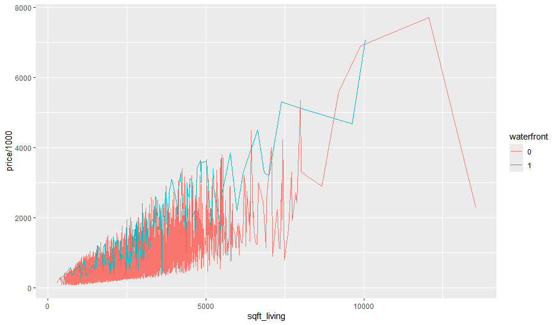

Questions:

12a -

* The chart has two lines now: the red-colored line shows waterfront=0, which is non-waterfront
houses; the blue-colored line shows waterfront=1, which is waterfront houses. Which of the
following best describes the relationships in the chart?
** Waterfront houses are generally more expensive than non-waterfront houses. And, their
prices increase as sqft living increases. - TRUE (the blue line appears to be higher than red line at all the price points and sqft)
** Waterfront houses are the same price as non-waterfront houses. But, their prices increase
as sqft_living increases. - FALSE

12b -

* Does this relationship make sense in real world? Why/Why not?
** Yes, this relationship makes sense in the real world. Waterfront properties are considered more valuable due to their scenic views, exclusivity, and high demand. People often pay a premium for a home with direct water access. Additionally, as sqft_living increases, the price increases because larger homes require more materials, land, and labor to build. The trend aligns with real-world housing market behavior, where location and property features significantly influence pricing.

== SCATTER PLOT
Scatter plot is another tool to identify relationships.
13a - Using "yr built" and "price" to see if there is
a relationship between the price of a house and the year that house is built
[source,R]
----
# 13a Create a scatterplot for yr_built and price
ggplot(data = housing) +
  geom_point(mapping = aes( x= yr_built, y = price))
----
output

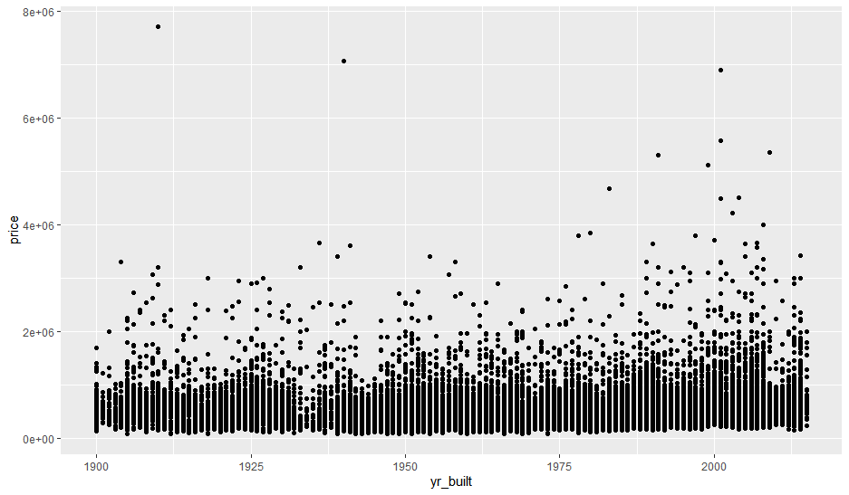

Questions:

* Which of the following best describes the relationship shown?
** Price increases as houses get newer - This is a correlation but can not be inferred from the scatter plot
** There is no discernible relationship between prices and year built - TRUE, as most of the scatter is below $400,000 there are some outliers for some houses that were built way earlier too

13b - Reduce/Change the marker size for better visualization
[source,R]
----
# 13b
# Change the marker in a scatterplot
# Add a line to see the relationship
ggplot(data = housing, mapping = aes( x= yr_built, y = price)) +
  geom_point(shape = 1, size = 0.5)+
  geom_smooth()
----
output

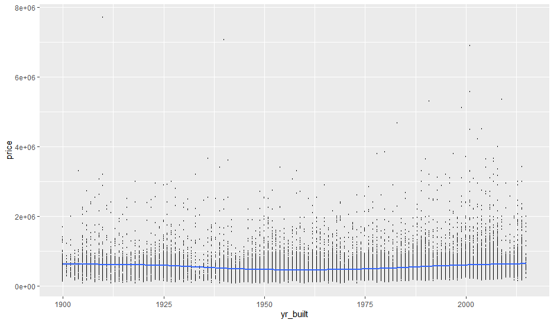

== BAR CHART

A bar chart to break down the average price by each property's condition. We should expect that prices increase as the conditions get better
[source,R]
----
# 14 Create a bar chart for the average price in each condition
# condition is mapped to x-axis and average price is mapped to y-axis
ggplot(data = housing, aes(x = as.factor(condition), y = price)) +
  stat_summary(fun = mean, geom = 'bar')
----
output

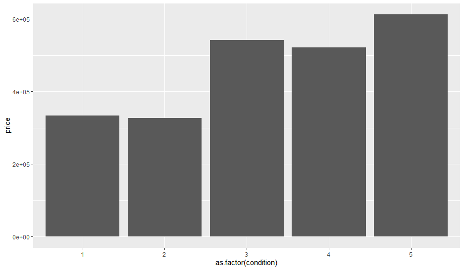

[source,R]
----
# 15
# Load the necessary packages
library(ggplot2)
library(scales)

# Create the plot with formatted y-axis and rounded mean values
ggplot(data = housing, aes(x = as.factor(condition), y = price)) +
  stat_summary(fun = function(x) round(mean(x), 2), geom = 'bar') +
  stat_summary(fun = function(x) round(mean(x), 2), geom = 'text', aes(label = round(..y.., 2)), vjust = -0.5) +
  scale_y_continuous(labels = dollar)
----

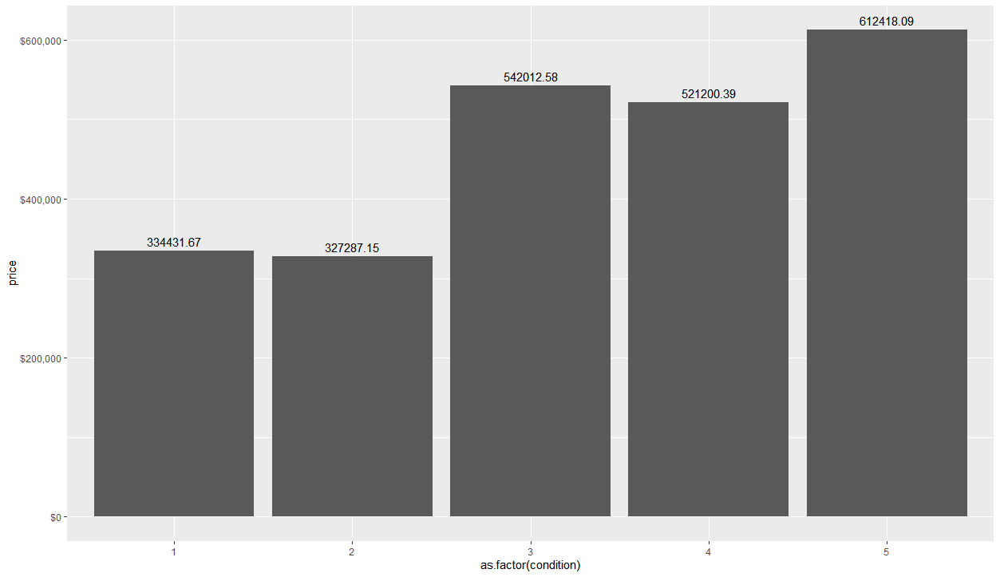

Questions: What are the mean prices for the following conditions:

* Condition 1 = $ 334,431.67
* Condition 3 = $ 542,012.58
* Condition 5 = $ 612,418.09
* This means, condition 5 houses are in better shape than others (because they sell for more). Is this
true based on the above values?
** Not necessarily, this is a correlation but may not be causation, selling price of a home involves many more factors such as number of bedrooms, bathrooms, etc., other than just the condition of the home