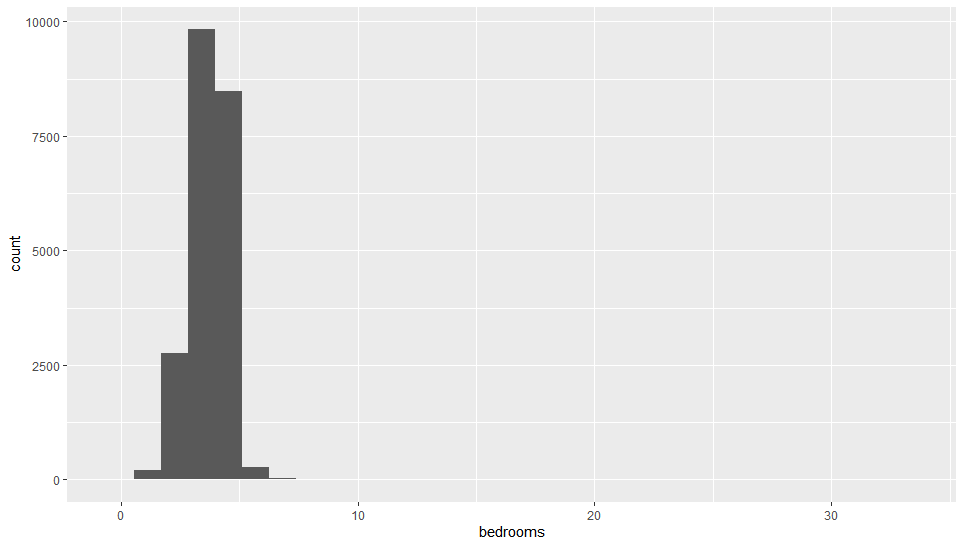

= Homework 1 Group 14

Team members:

* Varuni Rao
* Ummul Mukta
* Nishanth Holla Raghavendra
* Aravind Sarma Yeluripati

== IMPORT DATA

Start R Studio and import the data set into your environment
[source,R]
----
# load data
housing <- read.csv("C:/…//housing.csv", header = TRUE)
----
output

[source,R]
----
# find the dimension of data frame
dim(housing)
----
output

 [1] 21613    21

== EXPLORE THE DATA
Start exploring the data by looking at the first few observations.
[source,R]
----
# show the first six rows
head(housing)
----
output

image::../images/headHousing.png[headHousing.png]

[source,R]
----
# show all the data in a new tab
View(housing)
----
output

see summary statistics for each variable
[source,R]
----
# find summary statistics for each column
summary(housing)
----
output

image::../images/summaryHousing.png[summaryHousing.png]

Question: Do any of these measures seem unreasonable?

Answers:

* 0 bathrooms is questionable, maybe there’s missing data.
* The number 3.5 for floors seem unreasonable, the number of floors are supposed to be whole numbers
* The summary data for year of innovation seems useless
* The summary data for zip codes is off too as the data is interpreted as numbers when it's supposed to be enum
* The mean of waterfront doesn't make sense either since a property is either a waterfront or it is not

== DATA VISUALIZATIONS IN  R

[source,R]
----
# install ggplot2 once
install.packages("ggplot2")
#the following wouldn't work since the quotes are missing
install.packages(ggplot2)
----

== HISTOGRAM
[source,R]
----
# Create a histogram
ggplot(housing) + geom_histogram(aes(x=bedrooms), bins=6)
----
output

image::../images/lineItem4.png[]

Questions:

* Which bedroom range has the greatest number of observations (i.e., tallest bar)?
* How many observations are there in this range?
* What type of skew is this?
* What type of transformation would correct this skew?

[source,R]
----
# Create a histogram with more detail
ggplot(housing) + geom_histogram(aes(x=bedrooms), bins=30)
----
output

Questions:

* Having more bins provides a more detailed view
* Which range has the highest frequency in the plot?
* How many observations are there for this range?
* what else can you infer from this histogram (about normally, outliers, and transformations?)

== BOXPLOT
[source,R]
----
# Create a boxplot for bathrooms
ggplot(housing) + geom_boxplot(aes(x=bathrooms))
----
output

Questions: Find the answers of the following:

* Minimum Whisker =
* Maximum Whisker =
* Median =
* First (25th) quartile =
* Third (75th) quartile =

== BOXPLOT and CATEGORICAL VARIABLES
[source,R]
----
# Create a boxplot for bathrooms by floors
ggplot(housing, aes(x=as.factor(floors), y=bathrooms)) +
  geom_boxplot() +
  xlab("Floors") +
  stat_summary(fun = mean,color="red", shape=12)
----
output

image::../images/lineItem10.png[]

Questions:

* Based on the box plots, which floors have the highest mean for bathrooms? (means are shapes on box plots)
* Identify the farthest outlier(s) for "bathrooms". Which flooers have this outlier?

== LINE GRAPH
[source,R]
----
# Create a line graph for sqft_living and price
ggplot(data = housing) +
  geom_line(mapping = aes(x = sqft_living, y = price))
----
output

Questions:

* Which of the following best describes the relationship in the chart?
** Price increases as sqft living increases
** Price decreases as sqft living increases
* Does this relationship make sense in real world? Why/Why not?

== LINE GRAPH MULTIPLIERS
[source,R]
----
# variable, "waterfront". This will help validate/test the relationship we observed earlier for two conditions: waterfront or not. If the waterfront variable isn’t a factor (categorical) then it needs to be transformed:
housing$waterfront <- as.factor(housing$waterfront)

# Create a line graph for sqft_living and price for waterfront properties
ggplot(data = housing) +
  geom_line(aes(x = sqft_living, y = price/1000, color = waterfront ))
----
output

image::../images/lineItem12.png[]

Questions:

* The chart has two lines now: the red-colored line shows waterfront=0, which is non-waterfront
houses; the blue-colored line shows waterfront=1, which is waterfront houses. Which of the
following best describes the relationships in the chart?
** Waterfront houses are generally more expensive than non-waterfront houses. And, their
prices increase as sqft living increases.
** Waterfront houses are the same price as non-waterfront houses. But, their prices increase
as sqft_living increases.
* Does this relationship make sense in real world? Why/Why not?

== SCATTER PLOT
[source,R]
----
# 13a Create a scatterplot for yr_built and price
ggplot(data = housing) +
  geom_point(mapping = aes( x= yr_built, y = price))
----
output

image::../images/lineItem13a.png[]

Questions:

* Which of the following best describes the relationship shown?
** Price increases as houses get newer
** There is no discernible relationship between prices and year built

[source,R]
----
# 13b
# Change the marker in a scatterplot
# Add a line to see the relationship
ggplot(data = housing, mapping = aes( x= yr_built, y = price)) +
  geom_point(shape = 1, size = 0.5)+
  geom_smooth()
----
output

image::../images/lineItem13b.png[]

== BAR CHART
[source,R]
----
# 14 Create a bar chart for the average price in each condition
# condition is mapped to x-axis and average price is mapped to y-axis
ggplot(data = housing, aes(x = as.factor(condition), y = price)) +
  stat_summary(fun = mean, geom = 'bar')
----
output

image::../images/lineItem14.png[]

Questions: What are the mean prices for the following conditions:

* Condition 1 =
* Condition 3 =
* Condition 5 =
* This means, condition 5 houses are in better shape than others (because they sell for more). Is this
true based on the above values?